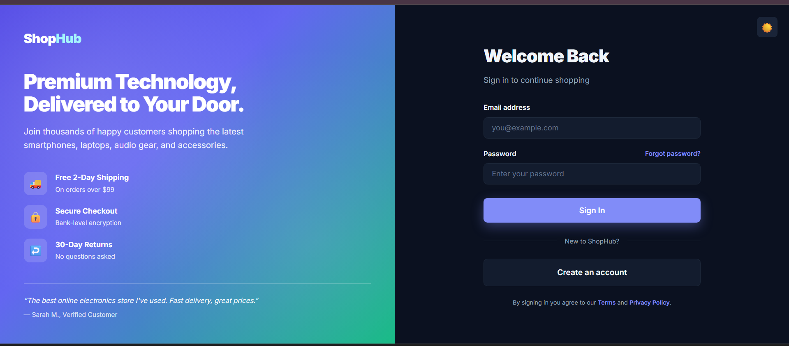
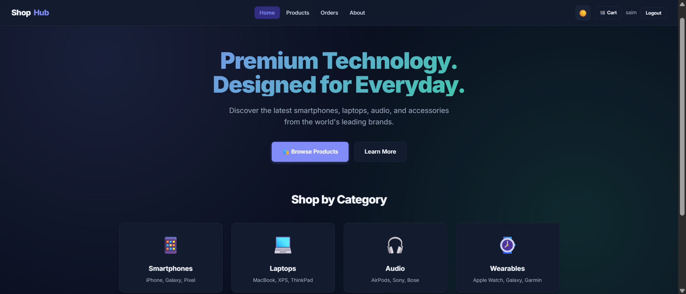
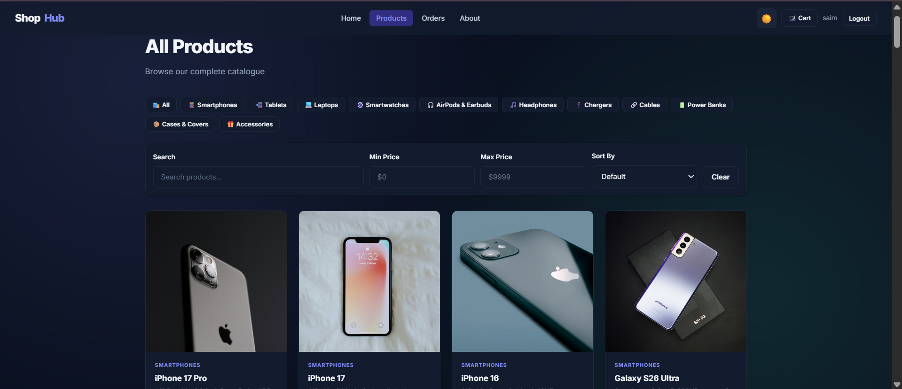
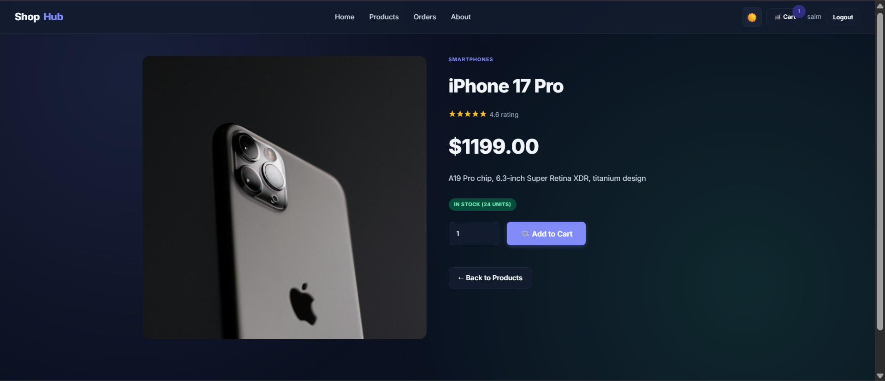
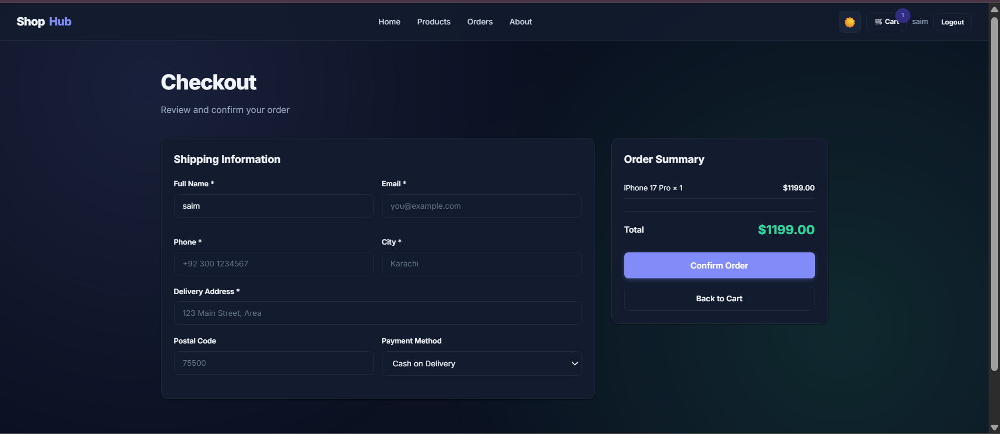
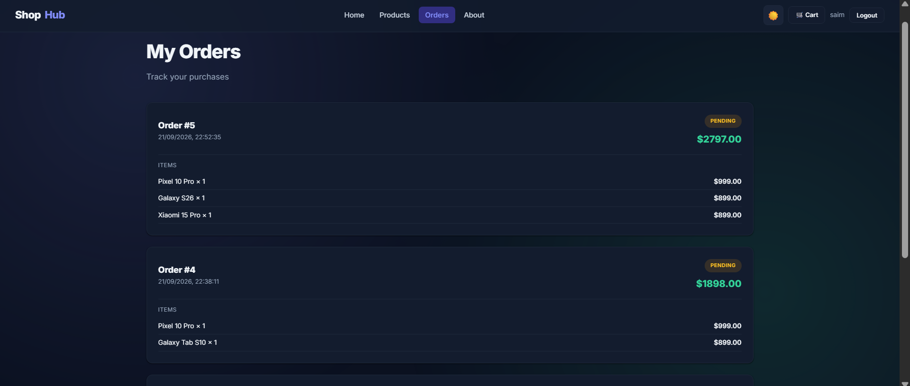

<div align="center">

# 🛍️ SHOP-HUB

### A Modern Full-Stack E-Commerce Platform

Built with **Node.js**, **Express**, **MySQL**, and **Vanilla JavaScript**

[](https://youtu.be/ZtXDOIp6818)
[](https://github.com/YOUR_USERNAME/ecommerce-store)


</div>

---

# 📌 Overview

**ShopHub** is a complete, production-ready e-commerce platform built from scratch. It features real JWT authentication, a catalogue of 58 products across 11 categories, a fully-functional shopping cart, checkout flow, order management, and a professional admin dashboard with live analytics.

Every feature works end-to-end — no mock data, no fake APIs. Real JWT tokens, real MySQL queries, real orders.

> **Built as an internship project** to demonstrate full-stack development capabilities including REST API design, database modelling, authentication, and modern UI development.

---
# 📸 Visuals

### 🔐 Authentication
Split-screen login with brand panel and feature highlights.



### 🏠 Home / Landing Page
Modern hero section with category showcase and theme toggle.



### 📦 Products Catalogue
58 products across 11 categories with real-time search, filter and sort.



### 📱 Product Details
Complete product information with stock status and add-to-cart.



### 💳 Checkout
Clean checkout flow with shipping form and order confirmation.



### 📋 Order History
Track past orders with status badges and itemised details.



---

# ✨ Features

### 👤 User Features
- **Secure Authentication** — JWT-based register and login with bcrypt password hashing
- **Product Browsing** — 58 products across 11 categories
- **Smart Search** — Search by name, description, or category
- **Advanced Filtering** — Filter by category and price range
- **Sorting** — Sort by price (low/high) or name (A-Z / Z-A)
- **Product Details** — Full descriptions, images, stock status, ratings
- **Shopping Cart** — Persisted to `localStorage`, survives page refreshes
- **Checkout Flow** — Shipping information with real order creation
- **Order History** — Track all past orders with status badges
- **Dark / Light Theme** — Preference persisted across sessions
- **Responsive Design** — Optimised for desktop, tablet, and mobile

### 👑 Admin Features
- **Live Dashboard** — Real-time counts for users, products, orders, revenue
- **Sales Analytics** — Chart.js line graph showing 7-day sales trend
- **Activity Logs** — Every user action logged with timestamp and IP
- **Product Management** — Full CRUD via REST API
- **Order Management** — View all orders and update statuses

### 🔒 Security
- JWT authentication with 7-day expiry
- bcrypt password hashing (10 salt rounds)
- Role-based access control (user vs admin)
- Protected API routes with middleware
- Environment variables for secrets

---

# 🛠️ Tech Stack

### Frontend
| Technology | Purpose |
|-----------|---------|
| HTML5 | Semantic markup |
| CSS3 | Custom design system with CSS variables |
| Vanilla JavaScript (ES6+) | No frameworks — pure JS for maximum learning |
| Chart.js | Sales trend visualization |
| Fetch API | HTTP requests |

### Backend
| Technology | Purpose |
|-----------|---------|
| Node.js | Runtime environment |
| Express.js | Web framework |
| MySQL2 | Promised-based MySQL client |
| JWT | Stateless authentication |
| bcryptjs | Password hashing |
| Winston | Structured logging |
| Helmet | Security headers |
| CORS | Cross-origin configuration |
| dotenv | Environment variable management |

### Database
| Technology | Purpose |
|-----------|---------|
| MySQL 8 | Relational database |
| phpMyAdmin | Database GUI |
| XAMPP | Local Apache + MySQL stack |

### Tools
| Tool | Purpose |
|------|---------|
| Postman | API testing (16 endpoints) |
| Git | Version control |
| VS Code | Code editor |
| Node Nodemon | Auto-restart during development |

---

# 🏗️ Architecture
```
┌─────────────────────────────────────────────────────────────┐
│ CLIENT (Browser)                                            │
│ ┌──────────────────────────────────────────────────────┐    │
│ │ HTML Pages + Custom CSS + Vanilla JavaScript         │    │
│ │ ─────────────────────────────────────────────────    │    │
│ │ • JWT stored in localStorage                         │    │
│ │ • Cart state in localStorage                         │    │
│ │ • Theme preference in localStorage                   │    │
│ └──────────────────────────────────────────────────────┘    │
└──────────────────────────┬──────────────────────────────────┘
│ HTTP Requests (fetch API)
│ Headers: Content-Type, Authorization
▼
┌─────────────────────────────────────────────────────────────┐
│ EXPRESS SERVER (Node.js - Port 5000)                        │
│ ┌──────────────────────────────────────────────────────┐    │
│ │ Middleware → Routes → Controllers → Utilities        │    │
│ │ ─────────────────────────────────────────────────    │    │
│ │ • auth.js → JWT verification                         │    │
│ │ • routes/* → Endpoint definitions                    │    │
│ │ • controllers/* → Business logic                     │    │
│ │ • activityLogger → Audit trail                       │    │
│ └──────────────────────────────────────────────────────┘    │
│ ┌──────────────────────────────────────────────────────┐    │
│ │ Static file server → serves /frontend                │    │
│ └──────────────────────────────────────────────────────┘    │
└──────────────────────────┬──────────────────────────────────┘
│ SQL Queries (mysql2/promise)
▼
┌─────────────────────────────────────────────────────────────┐
│ MySQL DATABASE                                              │
│ ───────────────────────────────────────────────────────     │
│ users │ products │ orders │ order_items │ activity_logs     │
└─────────────────────────────────────────────────────────────┘
```
---

# Request Flow (Example: Placing an Order)
```
User clicks "Confirm Order" in checkout.html
│

cart.js reads localStorage → builds items array
│

api.js sends POST /api/orders with JWT in Authorization header
│

Express matches /api/orders → routes/orders.js
│

middleware/auth.js verifies JWT → extracts user_id
│

controllers/orderController.js:
├─ Validates stock for each product
├─ Inserts row into orders table
├─ Inserts rows into order_items table
├─ Decrements products.stock
└─ Calls activityLogger()
│

activityLogger writes to activity_logs + console
│

Response: { orderId: X, total: Y }
│

Frontend clears cart + redirects to orders.html
```
---

# 📁 Project Structure

```
ecommerce-store/
│
├── .gitignore # Excludes node_modules, .env
├── README.md # Documentation (this file)
├── start.bat # One-click launcher (Windows)
├── stop.bat # Stop all services
│
├── backend/
│ ├── .env.example # Environment template
│ ├── package.json # Dependencies + scripts
│ ├── server.js # Express app entry point
│ ├── seed-products.js # One-time: seeds 58 products
│ │
│ ├── config/
│ │ ├── db.js # MySQL connection pool
│ │ └── logger.js # Winston logger (terminal only)
│ │
│ ├── controllers/
│ │ ├── authController.js # Register + login
│ │ ├── productController.js # Products CRUD
│ │ ├── orderController.js # Orders + order_items
│ │ └── adminController.js # Stats + activity logs
│ │
│ ├── middleware/
│ │ └── auth.js # protect + adminOnly
│ │
│ ├── routes/
│ │ ├── auth.js # /api/auth/*
│ │ ├── products.js # /api/products/*
│ │ ├── orders.js # /api/orders/*
│ │ ├── admin.js # /api/admin/*
│ │ └── test.js # /api/test/db
│ │
│ └── utils/
│ └── activityLogger.js # Writes to activity_logs table
│
├── frontend/
│ ├── index.html # Landing page
│ │
│ ├── css/
│ │ ├── theme.css # Color tokens + dark/light
│ │ ├── main.css # Layout + components
│ │ ├── dashboard.css # Admin-specific styles
│ │ ├── auth.css # Login / register split layout
│ │ └── animations.css # Keyframes + hover effects
│ │
│ ├── js/
│ │ ├── api.js # Fetch wrapper with JWT
│ │ ├── auth.js # Login / register handlers
│ │ ├── theme.js # Dark/light toggle
│ │ ├── navbar.js # Dynamic auth-aware navbar
│ │ ├── categories.js # Category metadata
│ │ ├── ui.js # Toast, skeleton, helpers
│ │ ├── products.js # Grid, filter, search, sort
│ │ ├── cart.js # Cart management
│ │ ├── orders.js # Checkout + order history
│ │ └── admin.js # Dashboard + Chart.js
│ │
│ └── pages/
│ ├── home.html # Products catalogue
│ ├── login.html # Split-layout login
│ ├── register.html # Split-layout register
│ ├── product-detail.html # Single product view
│ ├── cart.html # Shopping cart
│ ├── checkout.html # Order placement
│ ├── orders.html # Order history
│ ├── about.html # Brand story
│ │
│ └── admin/
│ └── dashboard.html # Admin dashboard
│
├── database/
│ └── ecommerce.sql # MySQL schema (5 tables)
│
├── postman/
│ ├── E-Commerce-Store-API.postman_collection.json
│ └── E-Commerce-Local.postman_environment.json
│
└── docs/
└── screenshots/
├── login.png
├── home.png
├── products.png
├── product-detail.png
├── cart.png
├── checkout.png
├── orders.png
└── admin-dashboard.png
```

---

# 🚀 Getting Started

## Prerequisites

| Tool | Version | Download |
|------|---------|----------|
| Node.js | v18+ | [nodejs.org](https://nodejs.org) |
| XAMPP | Any recent | [apachefriends.org](https://www.apachefriends.org) |
| Git | Latest | [git-scm.com](https://git-scm.com) |
| Postman *(optional)* | Latest | [postman.com](https://postman.com) |

## Installation

1. Clone the repository**

```bash
git clone https://github.com/YOUR_USERNAME/ecommerce-store.git
cd ecommerce-store
```
2. Install backend dependencies
```bash
cd backend
npm install
```
3. Set up the database
```
Open XAMPP Control Panel → Start Apache and MySQL
Open http://localhost/phpmyadmin
Create a database called ecommerce
Import database/ecommerce.sql into it
```
4. Configure environment variables
```
Copy backend/.env.example → backend/.env and update:
PORT=5000
DB_HOST=localhost
DB_USER=root
DB_PASSWORD=
DB_NAME=ecommerce
JWT_SECRET=your_long_random_secret_key
JWT_EXPIRES=7d
```
5. Seed products (optional but recommended)
```bash
node seed-products.js
```
Populates 58 products across 11 categories with real product images.

6. Create an admin user

Register a normal account via the app, then run in phpMyAdmin:

```
UPDATE users SET role = 'admin' WHERE email = 'your_email@example.com';
```
7. Running the Application

1. 🪟 Windows — One-Click Launcher
   
```
Double-click start.bat in the project root. It will:
Start XAMPP (Apache + MySQL)
Wait for MySQL to be ready
Start the Node.js backend
Open the browser to http://localhost:5000
To stop: run stop.bat
```

2. 💻 Manual (any OS)
```
Terminal 1 — Start XAMPP services via Control Panel
Terminal 2 — Start backend:
```

```bash
cd backend
npm run dev
Open browser: http://localhost:5000
```
---

## 🔐 Environment Variables

Create a `.env` file inside the `backend/` folder based on `.env.example`:

| Variable | Description | Example |
|----------|-------------|---------|
| `PORT` | Server port | `5000` |
| `DB_HOST` | MySQL host | `localhost` |
| `DB_USER` | MySQL user | `root` |
| `DB_PASSWORD` | MySQL password | *(empty for XAMPP default)* |
| `DB_NAME` | Database name | `ecommerce` |
| `JWT_SECRET` | Secret key for signing tokens | `long_random_string` |
| `JWT_EXPIRES` | Token expiry duration | `7d` |

> ⚠️ **Never commit `.env`** — only `.env.example` is safe to share.

---

# 🗄️ Database Schema

ShopHub uses **5 tables** with proper foreign key relationships. Full DDL available in [`database/ecommerce.sql`](database/ecommerce.sql).

### 📁 `users`

| Column | Type | Constraints | Notes |
|--------|------|-------------|-------|
| `id` | `INT` | `PRIMARY KEY AUTO_INCREMENT` | Unique user ID |
| `name` | `VARCHAR(100)` | `NOT NULL` | Full name |
| `email` | `VARCHAR(100)` | `UNIQUE NOT NULL` | Login identifier |
| `password` | `VARCHAR(255)` | `NOT NULL` | bcrypt hash |
| `role` | `ENUM('user','admin')` | `DEFAULT 'user'` | Access level |
| `created_at` | `TIMESTAMP` | `DEFAULT CURRENT_TIMESTAMP` | Registration time |

### 📁 `products`

| Column | Type | Constraints | Notes |
|--------|------|-------------|-------|
| `id` | `INT` | `PRIMARY KEY AUTO_INCREMENT` | Product ID |
| `name` | `VARCHAR(200)` | `NOT NULL` | Product name |
| `description` | `TEXT` | – | Full description |
| `price` | `DECIMAL(10,2)` | `NOT NULL` | Price in USD |
| `stock` | `INT` | `DEFAULT 0` | Available quantity |
| `category` | `VARCHAR(100)` | – | e.g., Smartphones |
| `image_url` | `VARCHAR(500)` | – | Image URL |
| `created_at` | `TIMESTAMP` | `DEFAULT CURRENT_TIMESTAMP` | Added date |

### 📁 `orders`

| Column | Type | Constraints | Notes |
|--------|------|-------------|-------|
| `id` | `INT` | `PRIMARY KEY AUTO_INCREMENT` | Order ID |
| `user_id` | `INT` | `FOREIGN KEY → users(id)` | Buyer |
| `total` | `DECIMAL(10,2)` | – | Total amount |
| `status` | `ENUM('pending','shipped','delivered','cancelled')` | `DEFAULT 'pending'` | State |
| `created_at` | `TIMESTAMP` | `DEFAULT CURRENT_TIMESTAMP` | Order date |

### 📁 `order_items`

| Column | Type | Constraints | Notes |
|--------|------|-------------|-------|
| `id` | `INT` | `PRIMARY KEY AUTO_INCREMENT` | Item ID |
| `order_id` | `INT` | `FOREIGN KEY → orders(id)` | Parent order |
| `product_id` | `INT` | `FOREIGN KEY → products(id)` | Product |
| `quantity` | `INT` | – | Units |
| `price` | `DECIMAL(10,2)` | – | Price snapshot |

### 📁 `activity_logs`

| Column | Type | Constraints | Notes |
|--------|------|-------------|-------|
| `id` | `INT` | `PRIMARY KEY AUTO_INCREMENT` | Log ID |
| `user_id` | `INT` | `FOREIGN KEY → users(id) NULLABLE` | Actor |
| `action` | `VARCHAR(255)` | `NOT NULL` | e.g., `"Registered new account"` |
| `ip` | `VARCHAR(45)` | – | IPv4 or IPv6 |
| `created_at` | `TIMESTAMP` | `DEFAULT CURRENT_TIMESTAMP` | When |

**Relationships:**
- `orders.user_id` → `users.id`
- `order_items.order_id` → `orders.id`
- `order_items.product_id` → `products.id`
- `activity_logs.user_id` → `users.id`
--- 

# 🔌 API Documentation

### Base URL
```text
http://localhost:5000/api
```

### Authentication Header
```text
Authorization: Bearer <JWT_TOKEN>
```
## 🔌 API Endpoints

**Base URL:** `http://localhost:5000/api`

**Auth Header:** `Authorization: Bearer <JWT_TOKEN>`

---

# 🔐 Auth

| Method | Endpoint | Auth | Description |
|:------:|:---------|:----:|:------------|
| `POST` | `/auth/register` | – | Create new account |
| `POST` | `/auth/login` | – | Login and receive JWT |

**Register example:**

```http
POST /api/auth/register
Content-Type: application/json

{
  "name": "John Doe",
  "email": "john@example.com",
  "password": "secret123"
}
```

**Login example:**

```http
POST /api/auth/login
Content-Type: application/json

{
  "email": "john@example.com",
  "password": "secret123"
}
```

**Success response:**

```json
{
  "token": "eyJhbGciOiJIUzI1NiIsInR5cCI6IkpXVCJ9...",
  "user": { "id": 1, "name": "John Doe", "role": "user" }
}
```

---

### 📦 Products

| Method | Endpoint | Auth | Description |
|:------:|:---------|:----:|:------------|
| `GET` | `/products` | – | List all products |
| `GET` | `/products/:id` | – | Get single product |
| `POST` | `/products` | Admin | Create product |
| `PUT` | `/products/:id` | Admin | Update product |
| `DELETE` | `/products/:id` | Admin | Delete product |


### 🛒 Orders

| Method | Endpoint | Auth | Description |
|:------:|:---------|:----:|:------------|
| `POST` | `/orders` | User | Place a new order |
| `GET` | `/orders/mine` | User | Get own order history |
| `GET` | `/orders/all` | Admin | Get all orders |
| `PUT` | `/orders/:id/status` | Admin | Update order status |


### 👑 Admin

| Method | Endpoint | Auth | Description |
|:------:|:---------|:----:|:------------|
| `GET` | `/admin/stats` | Admin | Dashboard statistics |
| `GET` | `/admin/logs` | Admin | Recent activity logs |


### 🧪 Test

| Method | Endpoint | Description |
|:------:|:---------|:------------|
| `GET` | `/test/db` | Database health check |

---

# 📮 Postman Collection

Import both files from the [`postman/`](postman/) folder:

- `E-Commerce-Store-API.postman_collection.json` — 16 requests across 5 folders
- `E-Commerce-Local.postman_environment.json` — environment variables

> 💡 The collection includes an auto-save script that stores your JWT into `{{adminToken}}` after login.
---

# 🧪 Testing

### 📮 Postman

Import the collection, select **E-Commerce Local** environment, then run requests in order:

1. **🔐 Auth** → Register → Login (auto-saves JWT)
2. **📦 Products** → Get All → Get One → Create → Update → Delete
3. **🛒 Orders** → Place Order → My Orders → All Orders → Update Status
4. **👑 Admin** → Dashboard Stats → Activity Logs
5. **🧪 Test** → DB Health

### 🧭 Manual Test Flow
```text
1.  Open http://localhost:5000
2.  Register a new account
3.  Login → redirected to products
4.  Browse → filter by category → search → sort
5.  Click product → add to cart
6.  View cart → adjust quantities
7.  Checkout → fill shipping → confirm order
8.  Orders page → verify order appears
9.  Logout → login as admin
10. Admin dashboard → verify stats + chart
11. Toggle dark/light theme
```
---

# 🎓 What I Learned

Building ShopHub taught me far more than just syntax:

- 🏗 **REST API architecture** — clean separation of routes, controllers, middleware
- 🔐 **JWT authentication** — how stateless auth works under the hood
- 🔒 **bcrypt password hashing** — why we never store plain-text passwords
- 🗄 **Database modelling** — foreign keys, transactions, snapshot prices in `order_items`
- 📊 **Activity logging** — audit trails via a dedicated `activity_logs` table
- 🎨 **CSS design systems** — building a scalable, themeable UI with CSS variables
- ⚡ **Vanilla JS patterns** — modules, async/await, error handling without frameworks
- 🐛 **Debugging real issues** — CORS, MySQL crash recovery, JWT expiry, file encoding
- 🧪 **Testing discipline** — Postman as living documentation
- 🚀 **Deployment thinking** — environment variables, one-click launchers, portability
---

# 👤 Author

**Warshia Rubab**

Full-stack developer passionate about clean architecture and modern web experiences.

<p align="left">
  <a href="https://github.com/warshia-rubab">
    
  </a>
  <a href="https://www.linkedin.com/in/warshia-rubab-3191b039b/ ">
    
  </a>
  <a href="https://youtu.be/ZtXDOIp6818">
    
  </a>
  <a href="mailto:warshiarubab9427@gmail.com">
    
  </a>
</p>

---

# 📄 License

This project is licensed under the **ISC License** — see the [LICENSE](LICENSE) file for details.

---

# 🙏 Acknowledgements

- [**XAMPP**](https://www.apachefriends.org/) — Local development stack
- [**Chart.js**](https://www.chartjs.org/) — Beautiful sales trend visualizations
- [**Unsplash**](https://unsplash.com/) — High-quality product photography
- [**Inter Font**](https://fonts.google.com/specimen/Inter) — Modern typography
- [**Shields.io**](https://shields.io/) — Badges used in this README
  
---

<div align="center">


### ⭐ If you found this project helpful, please give it a star!

</div>
