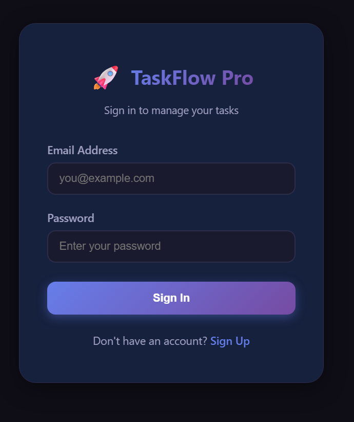
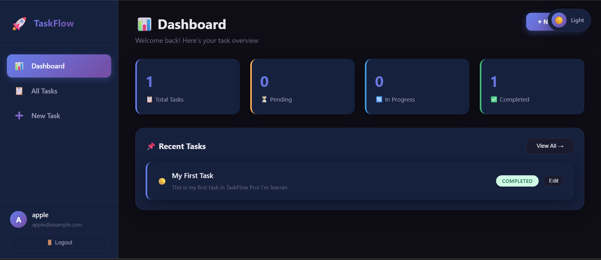
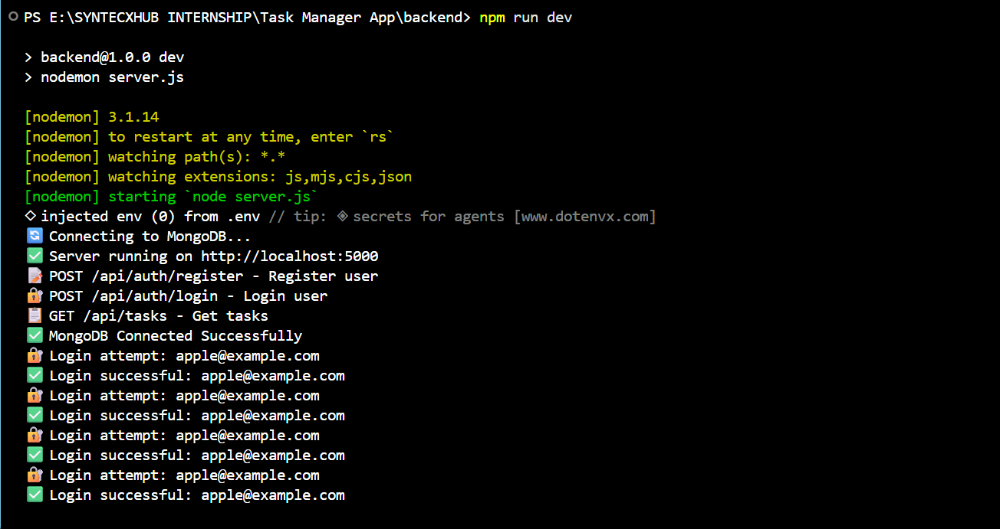

# 🚀 Task Manager App

<div align="center">

**A Professional Full-Stack Task Management Application**

[](https://github.com/yourusername/Syntexhub_TaskManager_App)
[](https://github.com/yourusername/Syntexhub_TaskManager_App)
[](https://github.com/yourusername/Syntexhub_TaskManager_App)
[](https://github.com/yourusername/Syntexhub_TaskManager_App)
[](LICENSE)

</div>

---


## 🎯 About The Project

**TaskFlow Pro** is a professional, enterprise-grade task management application built with the MERN stack. It was developed as part of the **SyntexHub Web Development Internship Program** and demonstrates advanced full-stack development skills including secure authentication, RESTful API design, database management, and modern UI/UX.

The application features a **dual-database architecture** — MongoDB for storing users and tasks, and MySQL for logging all user activities for audit purposes. It includes a **professional split-screen login page**, **dark/light theme toggle**, and a **real-time dashboard** with task statistics.

### 🎥 [Watch the Full Demo on YouTube](https://youtu.be/9K6Z4LHcR-Y)

---

## ✨ Key Features

<table>
<tr>
<td width="50%">

### 🔐 Authentication & Security
- JWT-based authentication
- Bcrypt password hashing
- Protected API routes
- Token-based session management
- Input validation & sanitization

### 📋 Task Management
- Create, Read, Update, Delete tasks
- Task status tracking (Pending/In Progress/Completed)
- Priority levels (Low/Medium/High)
- Due date management
- Search & filter functionality

</td>
<td width="50%">

### 🎨 Modern UI/UX
- Split-screen professional login
- Dark/Light theme toggle
- Responsive design (mobile-friendly)
- Animated gradient blobs
- Loading spinners & transitions
- Custom SVG icons

### 🗄️ Dual Database
- MongoDB for user/task data
- MySQL for activity logs
- Real-time dashboard statistics
- Persistent data storage

</td>
</tr>
</table>

---

## 🎥 Live Demo

**Watch the complete project demo:** [https://youtu.be/9K6Z4LHcR-Y](https://youtu.be/9K6Z4LHcR-Y)

### Demo Screenshots

<details>
<summary>🔐 <strong>Login Page (Dark Mode)</strong></summary>
<br>



</details>

<details>
<summary>📊 <strong>Dashboard</strong></summary>
<br>



</details>

<details>
<summary>➕ <strong>Create Task</strong></summary>
<br>


</details>

<details>
<summary>📋 <strong>Task List</strong></summary>
<br>



</details>

---

## 🛠️ Tech Stack

### Frontend
| Technology | Purpose |
|-----------|---------|
| **React.js 18** | UI Library |
| **Vite** | Build Tool |
| **React Router DOM 6** | Client-side Routing |
| **Axios** | HTTP Requests |
| **Context API** | State Management |
| **Custom CSS** | Styling & Theming |

### Backend
| Technology | Purpose |
|-----------|---------|
| **Node.js** | Runtime Environment |
| **Express.js** | Web Framework |
| **JWT** | Authentication |
| **Bcrypt.js** | Password Hashing |
| **CORS** | Cross-Origin Requests |
| **Dotenv** | Environment Variables |

### Databases
| Technology | Purpose |
|-----------|---------|
| **MongoDB** | User & Task Data |
| **MySQL** | Activity Logs |

---

## 🏗️ Architecture
┌─────────────────────────────────────────────────────────────┐
│ FRONTEND (React + Vite) │
│ http://localhost:5173 │
│ │
│ ┌──────────┐ ┌──────────┐ ┌──────────┐ ┌──────────┐ │
│ │ Login │ │ Signup │ │Dashboard │ │Task Mgmt │ │
│ └──────────┘ └──────────┘ └──────────┘ └──────────┘ │
└──────────────────────────┬──────────────────────────────────┘
│
Axios HTTP Requests
│
▼
┌─────────────────────────────────────────────────────────────┐
│ BACKEND (Node + Express) │
│ http://localhost:5000 │
│ │
│ ┌──────────┐ ┌──────────┐ ┌──────────┐ ┌──────────┐ │
│ │ /auth │ │ /tasks │ │ JWT │ │ Bcrypt │ │
│ │ Routes │ │ Routes │ │ Auth │ │ Hash │ │
│ └──────────┘ └──────────┘ └──────────┘ └──────────┘ │
└──────────────┬───────────────────────────┬──────────────────┘
│ │
▼ ▼
┌──────────────────┐ ┌──────────────────┐
│ MongoDB │ │ MySQL │
│ (User & Tasks) │ │ (Activity Logs) │
└──────────────────┘ └──────────────────┘

text

---

## 🚀 Getting Started

### Prerequisites

Before you begin, ensure you have the following installed:

- **Node.js** (v18 or higher) — [Download](https://nodejs.org/)
- **MongoDB** (Local or [MongoDB Atlas](https://www.mongodb.com/cloud/atlas)) — [Download](https://www.mongodb.com/try/download/community)
- **MongoDB Compass** — [Download](https://www.mongodb.com/products/compass)
- **XAMPP** (for MySQL) — [Download](https://www.apachefriends.org/)
- **Git** — [Download](https://git-scm.com/)

### Installation

**1. Clone the repository**
```bash
git clone https://github.com/yourusername/Syntexhub_TaskManager_App.git
cd Syntexhub_TaskManager_App
2. Setup Backend

bash
cd backend
npm install
Create a .env file in the backend folder:

env
PORT=5000
MONGO_URI=mongodb://127.0.0.1:27017/taskflow
JWT_SECRET=your_super_secret_jwt_key_here
MYSQL_HOST=localhost
MYSQL_USER=root
MYSQL_PASSWORD=
MYSQL_DATABASE=taskflow_logs
3. Setup Frontend

bash
cd ../frontend
npm install
4. Setup MySQL Database

Open XAMPP Control Panel

Start Apache and MySQL

Open phpMyAdmin: http://localhost/phpmyadmin

Create a new database named taskflow_logs

5. Setup MongoDB

Start MongoDB Compass

Connect to mongodb://localhost:27017

Create a new database named taskflow

Running the Application
Terminal 1 — Start MongoDB:

bash
mongod --dbpath "C:\data\db"
Terminal 2 — Start MySQL:

text
Open XAMPP Control Panel → Start MySQL
Terminal 3 — Start Backend:

bash
cd backend
npm run dev
Terminal 4 — Start Frontend:

bash
cd frontend
npm run dev
Open your browser:

text
http://localhost:5173
💻 Usage
1. Register a New Account
Navigate to /register and create a new account with your name, email, and password.

2. Login
Use your credentials on /login to sign in. You'll be redirected to the Dashboard.

3. Create Tasks
Click "+ New Task" to create a task with:

Title (required)

Description

Status: Pending / In Progress / Completed

Priority: Low / Medium / High

Due Date

4. Manage Tasks
View all tasks → Sidebar → "All Tasks"

Filter tasks → By status (Pending, In Progress, Completed)

Search tasks → Search bar on the task list page

Edit task → Click "Edit" on any task

Delete task → Click "Delete" and confirm

5. Toggle Theme
Click the 🌙/☀️ button in the top-right corner to switch between dark and light modes.

🔌 API Endpoints
Authentication
Method	Endpoint	Description	Auth Required
POST	/api/auth/register	Register a new user	❌
POST	/api/auth/login	Login with credentials	❌
GET	/api/auth/me	Get current user	✅
Tasks
Method	Endpoint	Description	Auth Required
GET	/api/tasks	Get all tasks for user	✅
POST	/api/tasks	Create a new task	✅
PUT	/api/tasks/:id	Update a task	✅
DELETE	/api/tasks/:id	Delete a task	✅
Example Request
bash
# Register
curl -X POST http://localhost:5000/api/auth/register \
  -H "Content-Type: application/json" \
  -d '{"name":"John Doe","email":"john@example.com","password":"password123"}'

# Login
curl -X POST http://localhost:5000/api/auth/login \
  -H "Content-Type: application/json" \
  -d '{"email":"john@example.com","password":"password123"}'

# Get Tasks (with token)
curl http://localhost:5000/api/tasks \
  -H "Authorization: Bearer YOUR_JWT_TOKEN"
📁 Project Structure
text
Syntexhub_TaskManager_App/
│
├── backend/
│   ├── config/
│   │   ├── db.js                 # MongoDB connection
│   │   └── mysql.js              # MySQL connection
│   ├── controllers/
│   │   ├── authController.js     # Auth logic
│   │   └── taskController.js     # Task logic
│   ├── middleware/
│   │   └── auth.js               # JWT verification
│   ├── models/
│   │   ├── User.js               # User schema
│   │   └── Task.js               # Task schema
│   ├── routes/
│   │   ├── auth.js               # /api/auth routes
│   │   └── tasks.js              # /api/tasks routes
│   ├── .env                      # Environment variables
│   ├── package.json
│   └── server.js                 # Entry point
│
├── frontend/
│   ├── public/
│   │   └── index.html
│   ├── src/
│   │   ├── components/
│   │   │   ├── Login.jsx         # Split-screen login
│   │   │   ├── Register.jsx      # Registration form
│   │   │   ├── Dashboard.jsx     # Stats dashboard
│   │   │   ├── TaskList.jsx      # Task list view
│   │   │   ├── TaskForm.jsx      # Create/Edit form
│   │   │   ├── Sidebar.jsx       # Navigation
│   │   │   └── ThemeToggle.jsx   # Dark/Light toggle
│   │   ├── context/
│   │   │   └── AuthContext.jsx   # Auth state
│   │   ├── styles/
│   │   │   ├── App.css           # Main styles
│   │   │   ├── auth.css          # Auth pages styles
│   │   │   ├── theme.css         # Theme variables
│   │   │   └── dashboard.css     # Dashboard styles
│   │   ├── App.jsx               # Routes
│   │   ├── main.jsx              # Entry point
│   │   └── index.css             # Global styles
│   ├── package.json
│   └── vite.config.js
│
├── database/
│   └── init.sql                  # MySQL init script
│
├── .gitignore
├── README.md
└── start-all.bat                 # One-click launcher
📸 Screenshots
🔐 Login Page (Dark Mode)
https://via.placeholder.com/800x400/13111c/ffffff?text=Login+Page+-+Dark+Mode

📊 Dashboard
https://via.placeholder.com/800x400/0f0e17/ffffff?text=Dashboard+with+Stats

➕ Create Task
https://via.placeholder.com/800x400/16213e/ffffff?text=Create+New+Task

🌙 Dark Mode
https://via.placeholder.com/800x400/1a1a2e/ffffff?text=Dark+Mode

💡 Tip: Replace these placeholder images with your actual screenshots after uploading them to the repository.

🗺️ Roadmap
✅ Completed (v1.0.0)
☑ User Authentication (JWT)
☑ Task CRUD Operations
☑ Dashboard with Statistics
☑ Dark/Light Theme
☑ Search & Filter
☑ MySQL Activity Logs
☑ Responsive Design
🚧 In Progress (v1.1.0)
□ Email verification
□ Password reset functionality
□ Task categories/tags
□ Drag & drop task reordering
□ User profile page
🔮 Planned (v2.0.0)
□ Team collaboration
□ Task reminders (email/push)
□ File attachments
□ Kanban board view
□ Calendar view
□ Analytics dashboard
□ Export to PDF/CSV
🤝 Contributing
Contributions are what make the open-source community amazing. Any contributions you make are greatly appreciated.

Fork the Project

Create your Feature Branch (git checkout -b feature/AmazingFeature)

Commit your Changes (git commit -m 'Add some AmazingFeature')

Push to the Branch (git push origin feature/AmazingFeature)

Open a Pull Request

📄 License
Distributed under the MIT License. See LICENSE for more information.

📬 Contact
Your Name — Your LinkedIn

Project Link — https://github.com/yourusername/Syntexhub_TaskManager_App

Demo Video — https://youtu.be/9K6Z4LHcR-Y

🙏 Acknowledgments
SyntexHub — For the internship opportunity

React — Frontend library

Node.js — Backend runtime

MongoDB — Database

MongoDB Compass — GUI for MongoDB

Shields.io — For the badges

Best-README-Template — For the template inspiration

<div align="center">
⭐ If you found this project helpful, please give it a star!
Built with ❤️ during the SyntexHub Internship Program

https://img.shields.io/badge/Made%2520with-%E2%9D%A4%EF%B8%8F-red?style=for-the-badge
https://img.shields.io/badge/SyntexHub-Internship-667eea?style=for-the-badge

</div> ```
