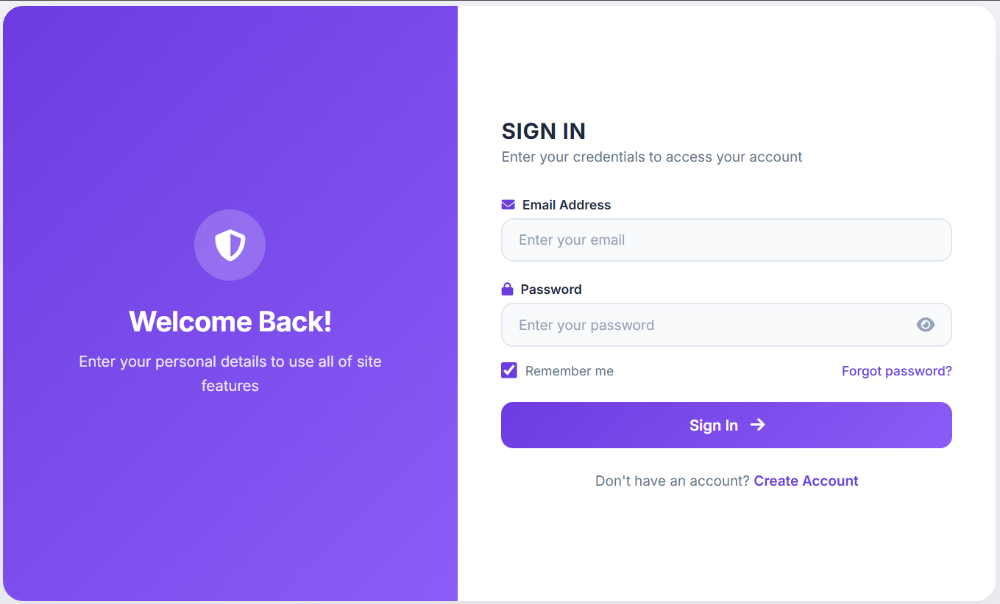
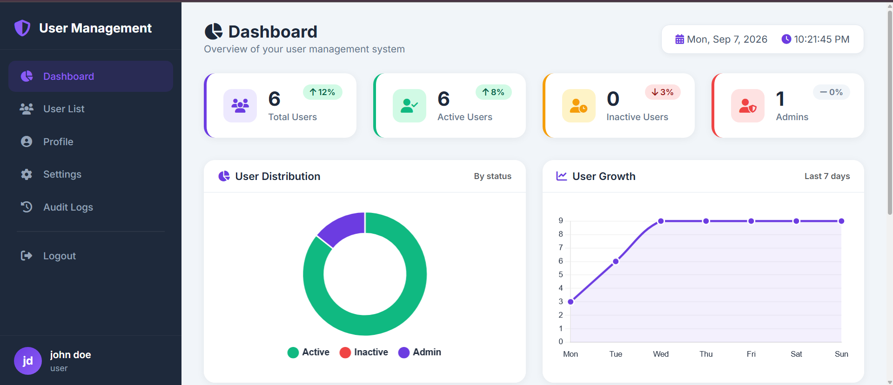
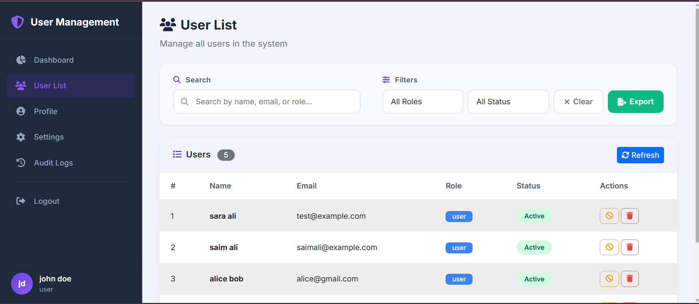

<div align="center">

# 👑 User Management System

> A complete, enterprise-grade User Management System with JWT authentication, role-based access control, and a modern dark/light theme interface.

[](https://youtu.be/iR-7ef-GQXA)
[](https://opensource.org/licenses/MIT)
[](https://nodejs.org/)
[](https://www.mongodb.com/)

</div>

---

# 📌 Project Overview

This is a **complete User Management System** built during the **Syntexhub Internship Program**. It demonstrates professional full-stack development with secure authentication, CRUD operations, and a polished user interface.

**🎯 Project Goal:** To build a production-ready application that showcases real-world development skills including API design, database management, security implementation, and modern UI/UX principles.

---

# 🎬 Watch the Demo

<div align="center">

| [](https://youtu.be/iR-7ef-GQXA) |
|:--:|
| *Click the thumbnail to watch the full demo on YouTube* |

</div>

---

# 📸 Application Screenshots

<div align="center">

### 🔐 Login Page
[](Login.png)
*Secure login with JWT authentication*

---

### 📊 Dashboard View
[](Dashboard.png)
*Analytics dashboard with charts and statistics*

---

### 👥 User List
[](UserList.png)
*Search, filter, and manage users efficiently*

</div>

---

# ✨ Key Features

### 🔐 Authentication & Security
- ✅ **JWT-based Authentication** - Secure token-based login
- ✅ **Password Hashing** - Using `bcryptjs` for encryption
- ✅ **Role-Based Access Control** - Admin vs. Regular User
- ✅ **Account Lockout** - Protection against brute force attacks

### 👥 User Management
- ✅ **Full CRUD Operations** - Create, Read, Update, Delete users
- ✅ **User Status Toggle** - Activate/Deactivate accounts
- ✅ **Password Change** - Secure password updates
- ✅ **Profile Management** - Users can update their own profile

### 🎨 User Experience
- ✅ **Dark/Light Theme** - Seamless theme switching
- ✅ **Responsive Design** - Optimized for all devices
- ✅ **Interactive Dashboard** - Charts & analytics with Chart.js
- ✅ **Search & Filter** - Find users by name, email, or role
- ✅ **Export to CSV** - Download user data

### 📊 Monitoring & Logs
- ✅ **Audit Logs** - Track all user activities
- ✅ **Log Viewer** - phpMyAdmin-style log interface
- ✅ **System Monitoring** - Real-time request logging

---

# 🛠️ Technology Stack

| Category | Technology |
|----------|------------|
| **Backend** | Node.js, Express.js |
| **Database** | MongoDB, Mongoose |
| **Authentication** | JWT, bcryptjs |
| **Frontend** | HTML5, CSS3, JavaScript, Bootstrap 5 |
| **Charts** | Chart.js |
| **Logging** | MySQL |
| **Security** | cors, helmet, express-rate-limit |

---

# 📂 Project Structure
```bash
User-Management/
├── 📁 backend/
│ ├── 📁 config/ # Database configuration
│ ├── 📁 controllers/ # Business logic
│ ├── 📁 middleware/ # Auth & logging
│ ├── 📁 models/ # MongoDB schemas
│ ├── 📁 routes/ # API routes
│ └── 📄 server.js # Entry point
├── 📁 frontend/
│ ├── 📁 css/ # Stylesheets
│ ├── 📁 js/ # Frontend logic
│ ├── 📁 pages/ # HTML pages
│ ├── 📄 index.html # Login page
│ └── 📄 register.html # Registration page
├── 📁 logs/
│ ├── 📄 log_handler.php # PHP log handler
│ └── 📄 viewer.php # Log viewer
├── 📁 scripts/
│ ├── 📄 start.bat # Startup script
│ └── 📄 install.bat # Install dependencies
├── 📄 .env.example # Environment template
├── 📄 .gitignore # Git ignore
├── 📄 package.json # Dependencies
├── 📄 README.md # This file
├── 📄 Login.png # Login page screenshot
├── 📄 Dashboard.png # Dashboard screenshot
├── 📄 UserList.png # User list screenshot
└── 📄 SidePanel.png # Side panel screenshot
```
---

# 🚀 Getting Started

### Prerequisites

| Tool | Version | Purpose |
|------|---------|---------|
| Node.js | v16+ | Runtime environment |
| MongoDB | v5+ | User database |
| MySQL | v8+ | Audit logs |
| XAMPP | v3+ | PHP log viewer (optional) |

---

# Installation & Setup

#### 1️⃣ Clone the Repository
```bash
git clone https://github.com/warshia-rubab/Syntexhub-User-Management.git
cd Syntexhub-User-Management
```

#### 2️⃣ Install Dependencies
```bash
npm install
```

#### 3️⃣ Configure Environment
```bash
cp .env.example .env
Update .env with your database credentials.
```

#### 4️⃣ Start the Application
Option A: Using Windows Startup Script

```bash
start.bat
```
Option B: Using Terminal

```bash
# Terminal 1 - Start Backend
npm run dev

# Terminal 2 - Start Frontend
npx http-server frontend -p 3000 -o
```

#### 5️⃣ Access the Application
```
🌐 Frontend: http://localhost:3000
🚀 Backend API: http://localhost:5000
📊 Log Viewer: http://localhost/logs/viewer.php
```
---

# 📋 API Documentation

### 🔓 Public Routes (No Token Required)
| Method | Endpoint | Description |
|--------|----------|-------------|
| `POST` | `/api/users/register` | Register a new user |
| `POST` | `/api/users/login` | Login user |

### 🔒 Protected Routes (Token Required)
| Method | Endpoint | Description |
|--------|----------|-------------|
| `GET` | `/api/users/users` | Get all users |
| `GET` | `/api/users/users/:id` | Get a single user |
| `PUT` | `/api/users/users/:id` | Update user |
| `DELETE` | `/api/users/users/:id` | Delete a user |
| `PUT` | `/api/users/change-password` | Change password |
| `PUT` | `/api/users/toggle-status/:id` | Toggle user status |

---

# 🔑 Test Credentials
```
json
{
  "email": "testuser@example.com",
  "password": "TestPass123"
}
```
---

# 🤝 Contributing

1. Contributions are welcome! Please feel free to submit a Pull Request.

2. Fork the repository

3. Create your feature branch (git checkout -b feature/AmazingFeature)

4. Commit your changes (git commit -m 'Add some AmazingFeature')

5. Push to the branch (git push origin feature/AmazingFeature)

6. Open a Pull Request

---

# 👨‍💻 Author
<div align="center">

**Warshia Rubab**

[](https://github.com/warshia-rubab)
[](https://linkedin.com/in/warshia-rubab)


</div>

---

# 🙏 Acknowledgements

1. Open Source Community - For the amazing libraries and tools

2. All Contributors - Who helped shape this project

---

# 📄 License

This project is licensed under the MIT License - see the LICENSE file for details.

---
